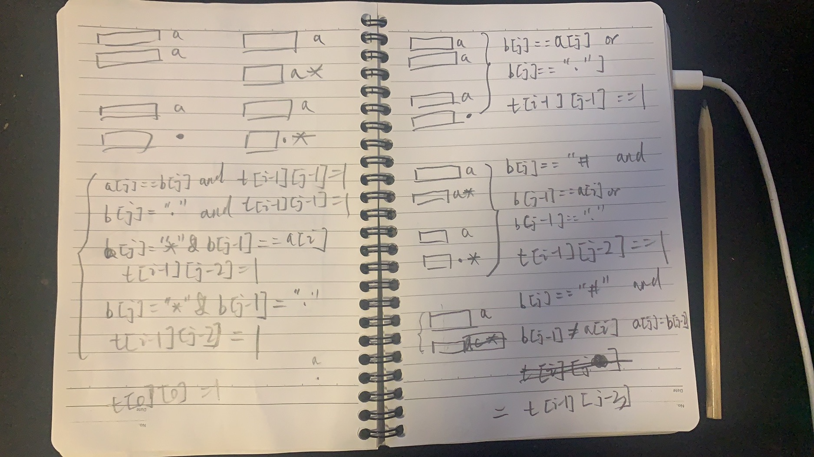

* content
{:toc}

⚠️前方，高能预警

这是第二道Hard的题目, 属于劝退类型

## 10. 正则表达式匹配

给你一个字符串 s 和一个字符规律 p，请你来实现一个支持 '.' 和 '*' 的正则表达式匹配。

'.' 匹配任意单个字符

'*' 匹配零个或多个前面的那一个元素

所谓匹配，是要涵盖整个字符串s的，而不是部分字符串。

说明:

s 可能为空，且只包含从 a-z 的小写字母。

p 可能为空，且只包含从 a-z 的小写字母，以及字符 . 和 *。

示例 1:

```
输入:
s = "aa"
p = "a"
输出: false
解释: "a" 无法匹配 "aa" 整个字符串。
```

示例 2:

```
输入:
s = "aa"
p = "a*"
输出: true
解释: 因为 '*' 代表可以匹配零个或多个前面的那一个元素, 在这里前面的元素就是 'a'。因此，字符串 "aa" 可被视为 'a' 重复了一次。
```

示例 3:

```
输入:
s = "ab"
p = ".*"
输出: true
解释: ".*" 表示可匹配零个或多个（'*'）任意字符（'.'）。
```

示例 4:

```
输入:
s = "aab"
p = "c*a*b"
输出: true
解释: 因为 '*' 表示零个或多个，这里 'c' 为 0 个, 'a' 被重复一次。因此可以匹配字符串 "aab"。
```

示例 5:

```
输入:
s = "mississippi"
p = "mis*is*p*."
输出: false
```

来源：力扣（LeetCode）

链接：[https://leetcode-cn.com/problems/regular-expression-matching/](https://leetcode-cn.com/problems/regular-expression-matching/)

Link：[https://leetcode.com/problems/regular-expression-matching/](https://leetcode.com/problems/regular-expression-matching/)

### 暴力破解

将字符串p中的字符*全排列展开，直到p与s长度相等为止，判断s是否和p一致

判断过程中，由于'.'可以匹配任意字符串，可以认为相等

### 动态规划

O(N^2)

定义xxx代表前i个字符串已经能够匹配，这里需要两个变量(i, j)分别代表字符串s和p

table[i][j] = True, 代表s前i个字符能够和p前j个字符匹配

#### 思考步骤

动态规划，先从最后一步倒推，假设字符串s和p能够匹配，那么最后一步可能是

> 下图中认为xxxxxxx部分已完成判断

条件1, 最后一步, s和p最后两个字母相等**或者**p最后一个字母是'.' 

```python
xxxxxxxxxxxx  a
xxxxxxxxxxxx  a

xxxxxxxxxxxx  a
xxxxxxxxxxxx  .

table[i][j] = ((p[i - i] == s[i - i] or p[i - i] == '.') and table[i - 1][j - 1])
```

条件2, 最后一步, p最后一个是\*, 无论是否能够匹配, 字符\*都可以零次展开

```python
xxxxxxxxxxx x  a
xxxxxxxxxxx a  *
            ^

xxxxxxxxxxx x  a
xxxxxxxxxxx c  *
            ^
# 0次展开，消耗p字符串*前面的一个字母, 用^来标记, 但s保持不变

table[i][j] = table[i][j - 2]
```

条件3, p最后一个是\*, 当\*一次展开时: (0和1次展开, 就可以覆盖0...k次的情况)

```python                                      
xxxxxxxxxxx x  a          xxxxxxxxxxx x  a
                                         ^
xxxxxxxxxxx a  *          xxxxxxxxxxx a  a  *
                                         
                    ->
xxxxxxxxxxx x  a          xxxxxxxxxxx x  a
                                         ^
xxxxxxxxxxx .  *          xxxxxxxxxxx .  .  *       

# 1次展开，消耗掉s字符串^对应的字母，但是p保持不变

table[i][j] = (p[j - 2] == s[i] or p[i - 2] == '.') and table[i - 1][j])
```

所有条件，只要有一个可以匹配，就可以认为匹配

#### 计算方向

从左到右，从比较短的字符开始，这样长字符，能够利用上短字符的计算结果

#### 边界条件

初始化table内容为False, 矩阵行列记得多开一个空间

其中table[0][0] = True, 代表两个空字符串可以匹配

table[i][0] = False, 也就是p为空，那除了s也为空外，都不能匹配

> ⚠️注意，前i个字符，对应的当前下标是i - 1。

```python

class Solution:
    def isMatch(self, s: str, p: str) -> bool:
        m = len(s)
        n = len(p)
        table = [[False for _ in range(n + 1)] for _ in range(m + 1)]

        for i in range(m + 1):
            for j in range(n + 1):
                if i == 0 and j == 0:
                    table[i][j] = True
                    continue

                if j == 0:
                    table[i][j] = False
                    continue

                if p[j - 1] != '*':
                    if i - 1 >= 0 and (p[j - 1] == '.' or p[j - 1] == s[i- 1]):
                        table[i][j] = table[i - 1][j - 1] # 尾字母可匹配
                else:
                    if j - 2 >= 0:
                        table[i][j] = table[i][j - 2] # 0次展开

                        if i - 1 >= 0 and (p[j - 2] == '.' or p[j - 2] == s[i - 1]):
                            table[i][j] = table[i][j] or table[i - 1][j] # 1次展开

        return table[m][n]
```

--End--

难度爆炸，随便的草稿，不值得细看


