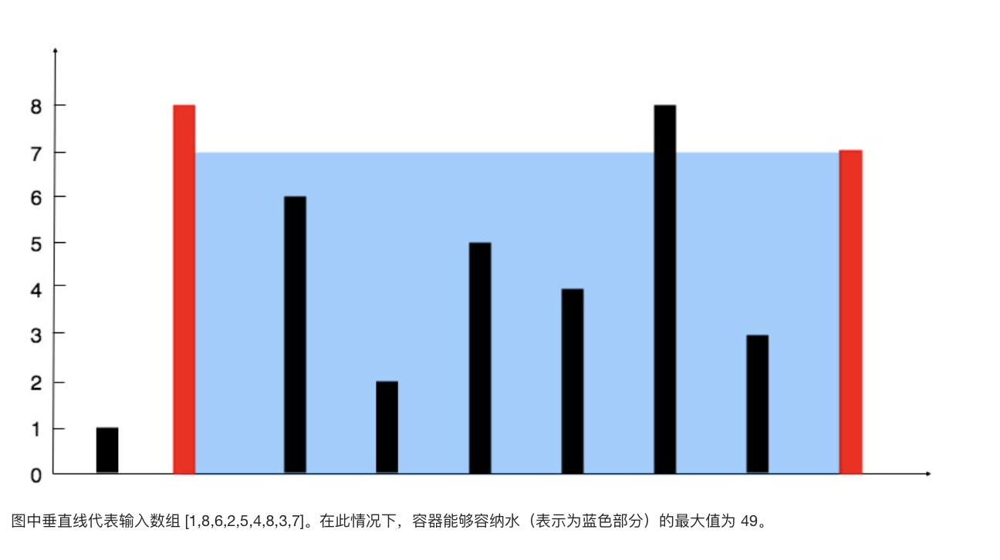

* content
{:toc}

## 11. 盛最多水的容器

给你 n 个非负整数 a1，a2，...，an，每个数代表坐标中的一个点 (i, ai) 。在坐标内画 n 条垂直线，垂直线 i 的两个端点分别为 (i, ai) 和 (i, 0)。找出其中的两条线，使得它们与 x 轴共同构成的容器可以容纳最多的水。

说明：你不能倾斜容器，且 n 的值至少为 2。



示例

```
输入：[1,8,6,2,5,4,8,3,7]
输出：49
```

来源：力扣（LeetCode）

链接：[https://leetcode-cn.com/problems/container-with-most-water/](https://leetcode-cn.com/problems/container-with-most-water/)

Link：[https://leetcode.com/problems/container-with-most-water/](https://leetcode.com/problems/container-with-most-water/)

## 暴力破解

O(N^2)

两边for循环，找出(i, j)组成容器的面积，通过打擂台记录最大的结果

## 双指针

O(N)

容器的"容积"V = 长 \* 高, 表示为(i, j), 其中j > i

**N**个数有**N-1**个间隙, 其中长, 最长的时候 **i = 0, j = len(arr) - 1**

通过不断缩短容器底部的长度，尝试找到更大的"容积"

如下图，当**arr[i] <= arr[j]**时, 此时，不论**arr[j - 1]**的大小如何

由于木桶效应，新的容器(i, j - 1) <= (i, j)

所以，可以放心的**i += 1**

```
｜                      #
｜                      #
｜                      #
｜                x     #
｜   #            x     #
｜   #            x     #
------------------------------
     i           j-1    j
```

```python
class Solution:
    def maxArea(self, height: List[int]) -> int:
        
        i = 0
        j = len(height) - 1
        res = 0
        
        while(i < j):
            
            water = (j - i) * min(height[i], height[j])

            if res < water:
                res = water
                
            if height[i] <= height[j]:
                i += 1
            else:
                j -= 1
                
        return res
```

--End--


