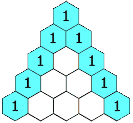

* content
{:toc}

## 119. 杨辉三角 II

给定一个非负索引 k，其中 k ≤ 33，返回杨辉三角的第 k 行。



在杨辉三角中，每个数是它左上方和右上方的数的和。

示例:

输入: 3
输出: [1,3,3,1]
进阶：

你可以优化你的算法到 O(k) 空间复杂度吗？

来源：力扣（LeetCode）

链接：[https://leetcode-cn.com/problems/pascals-triangle-ii](https://leetcode-cn.com/problems/pascals-triangle-ii)

Link：[https://leetcode.com/problems/pascals-triangle-ii/](https://leetcode.com/problems/pascals-triangle-ii/)

## 模拟

O(N^2)

整体思路还是和上一道题一致, 本题主要优化点是如何不使用额外空间

第K行有K+1个元素，那么这K+1是必须要是用的，不属于额外存储空间

```python
[1],
[1,1],
[1,2,1],
[1,3,3,1],
[1,4,6,4,1]
```

题目给的例子是首元素不堆砌的，尝试对齐再试试.

这样的话从第一个起**line[j] = last_line[j - 1] + last_line[j]**

记得要把前一个数字保存下来，不然会影响后面的结果

```python
class Solution:
    def getRow(self, rowIndex: int) -> List[int]:
        
        res = [1 for i in range(rowIndex + 1)]
        
        for i in range(rowIndex + 1):
            pre = 1
            for j in range(1, i):
                res[j], pre = pre + res[j], res[j]
                
        return res
```

倒序的话，你会发现，根本不用额外存储空间

```python
class Solution:
    def getRow(self, rowIndex: int) -> List[int]:
        
        res = [1 for i in range(rowIndex + 1)]
        
        for i in range(rowIndex + 1):
            for j in reversed(range(1, i)):
                res[j] = res[j - 1] + res[j]
                
        return res
```

--End--


