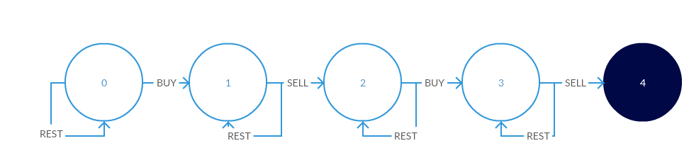

* content
{:toc}

## 前言

这道题，本身就非常难，把它作为一个动态规划题目的标杆就好了，仰望一下

## 123. 买卖股票的最佳时机 III

给定一个数组，它的第 i 个元素是一支给定的股票在第 i 天的价格。

设计一个算法来计算你所能获取的最大利润。你最多可以完成**两笔**交易。

注意：你不能同时参与多笔交易（你必须在再次购买前出售掉之前的股票）。

示例 1:

```
输入：prices = [3,3,5,0,0,3,1,4]
输出：6
解释：在第 4 天（股票价格 = 0）的时候买入，在第 6 天（股票价格 = 3）的时候卖出，这笔交易所能获得利润 = 3-0 = 3 。
     随后，在第 7 天（股票价格 = 1）的时候买入，在第 8 天 （股票价格 = 4）的时候卖出，这笔交易所能获得利润 = 4-1 = 3 。
```

示例 2：

```
输入：prices = [1,2,3,4,5]
输出：4
解释：在第 1 天（股票价格 = 1）的时候买入，在第 5 天 （股票价格 = 5）的时候卖出, 这笔交易所能获得利润 = 5-1 = 4 。   
     注意你不能在第 1 天和第 2 天接连购买股票，之后再将它们卖出。   
     因为这样属于同时参与了多笔交易，你必须在再次购买前出售掉之前的股票。
```

示例 3：

```
输入：prices = [7,6,4,3,1] 
输出：0 
解释：在这个情况下, 没有交易完成, 所以最大利润为 0。
```

示例 4：

```
输入：prices = [1]
输出：0
```

提示：

```
1 <= prices.length <= 105
0 <= prices[i] <= 105
```

来源：力扣（LeetCode）

链接：[https://leetcode-cn.com/problems/best-time-to-buy-and-sell-stock-iii](https://leetcode-cn.com/problems/best-time-to-buy-and-sell-stock-iii)

Link：[https://leetcode.com/problems/best-time-to-buy-and-sell-stock-iii/](https://leetcode.com/problems/best-time-to-buy-and-sell-stock-iii/)

## 暴力破解

O(N^2)

> 还能想出个暴力破解，不容易

这里两次买卖间不能有重叠，那就分成两部分，变成了两个LeetCode-121

前一段第i天一定是卖了，所以当天可以继续买

但，不出意外的超时了

```python
class Solution:
    def maxProfit(self, prices: List[int]) -> int:
        
        max_profit = 0
        for i in range(1, len(prices)):
            profit = self.helper(prices, 0, i) + self.helper(prices, i, len(prices) - 1)
            max_profit = max(max_profit, profit)
        
        return max_profit
        
    def helper(self, prices:List[int], start: int, end: int) -> int:
        
        profit = 0
        dp = [0 for i in range(start, end + 1)]
        low = float('inf')
        
        for i in range(start, end + 1):
            low = min(low, prices[i])
            profit = max(profit, prices[i] - low)
            
        return profit
```

## 动态规划 + 状态机

O(N)



每一个状态也可以什么都不做，那就保持愿状态不变

### 状态

```
s0什么都不做，依然在状态s0
s0如果买入，就到状态s1

s1什么都不做，依然在状态s1
s1如果卖出，就到状态s2

s2什么都不做，依然在状态s2
s2如果买入，就到状态s3

s3什么都不做，依然在状态s3
s3如果卖出，就到状态s4
```

### 状态转移

```python
# 假设，当前状态S, 前一个状态X
# 可以什么都做仍然在状态S，如果买入，相当于损失了钱
S = max(S, X - price)

# 类似的，卖出
S = Max(S, X + price)
```

代码如下

```python
class Solution:
    def maxProfit(self, prices: List[int]) -> int:
        
        s0 = 0
        s1 = s2 = s3 = s4 = float('-inf')
        for price in prices:
            s1 = max(s1, s0 - price)
            s2 = max(s2, s1 + price)
            s3 = max(s3, s2 - price)
            s4 = max(s4, s3 + price)
              
        return s4
```

## 动态规划

O(N)

### 状态定义

dp[k][i] 代表对于K次交易，第i天的最大收益

### 状态转移

1. 如果第i天什么都不做

```python
dp[k][i] = dp[k][i - 1]
```

2. 如果第i天卖掉了, 那么前面一定要先买，定义买的那天为j, 则 0 <= j < i

```python
# for循环 j = range(0, i), 找到最大的值
dp[k][i] = prices[i] - prices[j] + dp[k - 1][j - 1]
```

两种情况取最大值

### 初始化与边界条件

对于0次交易，收益都为0

注意, 遍历j的时候，要从1开始

### 计算方向

交易次数，由少到多

```python
class Solution:
    def maxProfit(self, prices: List[int]) -> int:
        
        dp = [[0 for i in range(len(prices))] for j in range(3)]
        
        for k in range(1, 3):
            for i in range(1, len(prices)):

                ## 重复计算(Start)
                low = prices[0]
                for j in range(1, i):       
                    low = min(low, prices[j] - dp[k - 1][j - 1])
                ## 重复计算(End)
                    
                dp[k][i] = max(dp[k][i - 1], prices[i] - low)
                
        return dp[2][-1]
```

对于上面第三个for循环, 有重复计算

```python
## 当i = 1时
low = prices[0]

## 当i = 2时
low = prices[0]
low = min(low, prices[1] - dp[k - 1][0])

## 当i = 3时
low = prices[0]
low = min(low, prices[1] - dp[k - 1][0])
low = min(low, prices[2] - dp[k - 1][1])

## 当i = 4时
low = prices[0]
low = min(low, prices[1] - dp[k - 1][0])
low = min(low, prices[2] - dp[k - 1][1])
low = min(low, prices[3] - dp[k - 1][2])
```

去掉重复计算，最终代码为:

```python
class Solution:
    def maxProfit(self, prices: List[int]) -> int:
        
        dp = [[0 for i in range(len(prices))] for j in range(3)]
        
        for k in range(1, 3):
            low = prices[0]
            for i in range(1, len(prices)):
                low = min(low, prices[i] - dp[k - 1][i - 1])
                dp[k][i] = max(dp[k][i - 1], prices[i] - low)
                
        return dp[2][-1]
```

## One More Thing

原来的low会保持k=1的最小值，然后是k=2的最小值

如果把两个for循环对掉一下, k的值是交替出现的, 需要单独数组来保持第k次交易的low值

```python
class Solution:
    def maxProfit(self, prices: List[int]) -> int:
        
        dp = [[0 for i in range(len(prices))] for j in range(3)]
        low = [prices[0] for i in range(3)]
        
        for i in range(1, len(prices)):
            for k in range(1, 3):
                low[k] = min(low[k], prices[i] - dp[k - 1][i - 1])
                dp[k][i] = max(dp[k][i - 1], prices[i] - low[k])                
                
        return dp[2][-1]
```

你会发现dp[k][i], 其中k只依赖k-1, i只依赖i-1, 所以把其中一维空间压缩，因为k比较小，选择压缩较大的i方向空间

```python
class Solution:
    def maxProfit(self, prices: List[int]) -> int:
        
        dp = [0 for j in range(3)]
        low = [prices[0] for i in range(3)]
        
        for i in range(1, len(prices)):
            for k in range(1, 3):
                low[k] = min(low[k], prices[i] - dp[k - 1])
                dp[k] = max(dp[k], prices[i] - low[k])                
                
        return dp[2]
```

因为k=2，可以把k展开

```python
class Solution:
    def maxProfit(self, prices: List[int]) -> int:
        
        dp = [0 for j in range(3)]
        low = [prices[0] for i in range(3)]
        
        for i in range(1, len(prices)):
            # low[1] = min(low[1], prices[i] - dp[0]), 因为dp[0] = 0 (0次交易收益总是0)
            low[1] = min(low[1], prices[i])
            dp[1] = max(dp[1], prices[i] - low[1])   

            low[2] = min(low[2], prices[i] - dp[1])
            dp[2] = max(dp[2], prices[i] - low[2])
                
        return dp[2]
```

四个变量就够了

```python
# low[1] = buy1
# low[2] = buy2
# dp[1] = sell1
# dp[2] = sell2

class Solution:
    def maxProfit(self, prices: List[int]) -> int:
        
        buy1 = buy2 = prices[0]
        sell1 = sell2 = 0
        
        for i in range(1, len(prices)):
            buy1 = min(buy1, prices[i])
            sell1 = max(sell1, prices[i] - buy1)   

            buy2 = min(buy2, prices[i] - sell1)
            sell2 = max(sell2, prices[i] - buy2)

        return sell2

# 从index = 0开始
class Solution:
    def maxProfit(self, prices: List[int]) -> int:
        
        buy1 = buy2 = float('inf')
        sell1 = sell2 = 0
        
        for i in range(len(prices)):
            buy1 = min(buy1, prices[i])
            sell1 = max(sell1, prices[i] - buy1)   

            buy2 = min(buy2, prices[i] - sell1)
            sell2 = max(sell2, prices[i] - buy2)

        return sell2
```

对于第一次购买:
每天尽可能在低点买入，再高点卖出

对于第二次购买：
同样的逻辑，只是把第一次交易的收入，合进第二次成本(比如你第一次已经赚了100¥，那么200¥的股票，你就相当于只花了100¥)

--End--