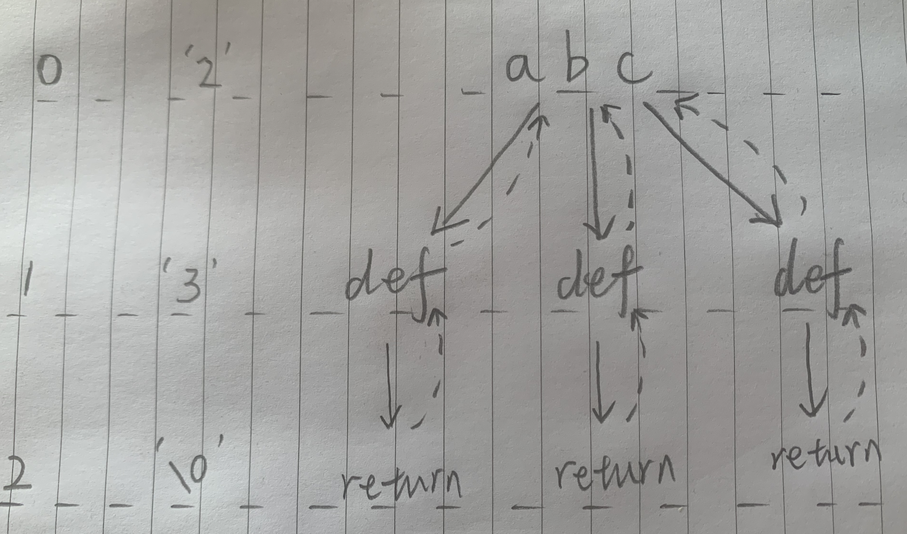

* content
{:toc}

## 17. 电话号码的字母组合

给定一个仅包含数字 2-9 的字符串，返回所有它能表示的字母组合。

给出数字到字母的映射如下（与电话按键相同）。注意 1 不对应任何字母。


示例:

```
输入："23"
输出：["ad", "ae", "af", "bd", "be", "bf", "cd", "ce", "cf"].
说明:
尽管上面的答案是按字典序排列的，但是你可以任意选择答案输出的顺序。
```

来源：力扣（LeetCode）

链接：[https://leetcode-cn.com/problems/letter-combinations-of-a-phone-number/](https://leetcode-cn.com/problems/letter-combinations-of-a-phone-number/)

Link：[https://leetcode.com/problems/letter-combinations-of-a-phone-number/](https://leetcode.com/problems/letter-combinations-of-a-phone-number/)

## DFS/Backtracking

O(2^N), 每个字母对应3-4个可能，也就是3^N ~ 4^N之间，大O表示法习惯用2来表示

这是DFS经典的应用场景之一，排列组合，**DFS需要多多练习，一分耕耘，一分收获**

简易的递归树如下图:

首先从数字'2'对应的abc开始, 从3个实线路径分别递归到下一层, 回溯过程用虚线表示

数字'3'对应的'def', 递归到下一层结束，拿到答案。



```python
class Solution:

    digitToLetter = {
        '2': 'abc',
        '3': 'def',
        '4': 'ghi',
        '5': 'jkl',
        '6': 'mno',
        '7': 'pqrs',
        '8': 'tuv',
        '9': 'wxyz',
    }

    def letterCombinations(self, digits: str) -> List[str]:    
        
        if digits is None or len(digits) == 0:
            return []
        
        res = []
        tmp = []
        
        self.helper(digits, 0, res, tmp)
        return res
    
    def helper(self, digits: str, start: int, res: List, tmp: List):
        
        if start == len(digits):
            res.append(''.join(tmp)) # 这里一定要拷贝
            return
        
        letters = self.digitToLetter[digits[start]]
        for i in range(len(letters)):

            tmp.append(letters[i])
            self.helper(digits, start + 1, res, tmp)
            tmp.pop()

```

打印下tmp中的内容具体浏览回溯的过程:

```
[]
['a']
['a', 'd']
['a', 'e']
['a', 'f']
['b']
['b', 'd']
['b', 'e']
['b', 'f']
['c']
['c', 'd']
['c', 'e']
['c', 'f']
```

--End--


