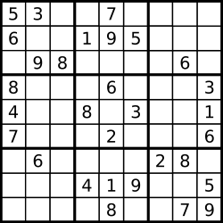
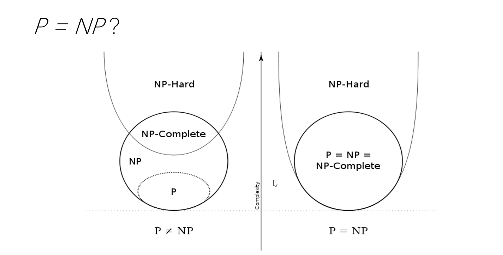

* content
{:toc}

## 36. 有效的数独

判断一个 9x9 的数独是否有效。只需要根据以下规则，验证已经填入的数字是否有效即可。

1. 数字 1-9 在每一行只能出现一次。
2. 数字 1-9 在每一列只能出现一次。
3. 数字 1-9 在每一个以粗实线分隔的 3x3 宫内只能出现一次。



上图是一个部分填充的有效的数独。

数独部分空格内已填入了数字，空白格用 '.' 表示。

示例 1:

```
输入:
[
  ["5","3",".",".","7",".",".",".","."],
  ["6",".",".","1","9","5",".",".","."],
  [".","9","8",".",".",".",".","6","."],
  ["8",".",".",".","6",".",".",".","3"],
  ["4",".",".","8",".","3",".",".","1"],
  ["7",".",".",".","2",".",".",".","6"],
  [".","6",".",".",".",".","2","8","."],
  [".",".",".","4","1","9",".",".","5"],
  [".",".",".",".","8",".",".","7","9"]
]
输出: true
```

示例 2:

```
输入:
[
  ["8","3",".",".","7",".",".",".","."],
  ["6",".",".","1","9","5",".",".","."],
  [".","9","8",".",".",".",".","6","."],
  ["8",".",".",".","6",".",".",".","3"],
  ["4",".",".","8",".","3",".",".","1"],
  ["7",".",".",".","2",".",".",".","6"],
  [".","6",".",".",".",".","2","8","."],
  [".",".",".","4","1","9",".",".","5"],
  [".",".",".",".","8",".",".","7","9"]
]
输出: false
解释: 除了第一行的第一个数字从 5 改为 8 以外，空格内其他数字均与 示例1 相同。
     但由于位于左上角的 3x3 宫内有两个 8 存在, 因此这个数独是无效的。
```

说明:

一个有效的数独（部分已被填充）不一定是可解的。
只需要根据以上规则，验证已经填入的数字是否有效即可。
给定数独序列只包含数字 1-9 和字符 '.' 。
给定数独永远是 9x9 形式的。

来源：力扣（LeetCode）

链接：[https://leetcode-cn.com/problems/valid-sudoku/](https://leetcode-cn.com/problems/valid-sudoku/)

Link：[https://leetcode.com/problems/valid-sudoku/](https://leetcode.com/problems/valid-sudoku/)

## 哈希

O(N^2)

分别用row, col, zone来代表行，列，每9宫格里面的数字

```
row[i][j] = True, 代表第i+1行数字j-1出现过
col[i][j] = True, 代表第i+1列数字j-1出现过
zone[i][j] = True, 代表第i+1九宫格数字j-1出现过
```

### P=NP?

> 大O表示法，表示的是算法时间复杂度的渐近上限; P是一类问题的集合，NP是一类问题的集合

P类问题(Polynomial)，确定多项式时间问题，是可以通过计算机快速解决的问题，也就是说在**多项式级别**时间复杂度解决的问题，比如O(1), O(logN), O(N), O(N*logN), O(N^2), O(N^3) ...

NP类问题(Nondeterministic Polynomial), **非确定**多项式时间, 问题的答案能够在多项式时间内验证是否正确。很明显P属于NP。NP类问题求解通常是O(2^N), O(N!) ...



P=NP？是计算机领域诞生出的一个数学问题，科研普遍相信P=NP是成立的，但目前没有办法证明成立/不成立，这还是千禧年七大未解数学难题之一

数独，是一个典型的NP问题，验证一个答案的时间复杂度是O(N^2), 求解数独的复杂度却是O(9^N), N = row * col, 如果N过大，那么相对于计算机来说不可解

```python
class Solution:
    def isValidSudoku(self, board: List[List[str]]) -> bool:
        
        n = len(board)
        row = [[False for j in range(n)] for i in range(n)]
        col = [[False for j in range(n)] for i in range(n)]
        zone = [[False for j in range(n)] for i in range(n)]
        
        for i in range(n):
            for j in range(n):
                if board[i][j] == '.':
                    continue
                   
                z = (i // 3 * 3) + j // 3
                number = int(board[i][j]) - 1
                if row[i][number] or col[j][number] or zone[z][number]:
                    return False
                
                row[i][number] = col[j][number] = zone[z][number] = True
                
        return True
```

--End--


