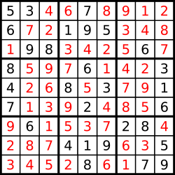

* content
{:toc}

## 37. 解数独

编写一个程序，通过已填充的空格来解决数独问题。

一个数独的解法需遵循如下规则：

数字 1-9 在每一行只能出现一次。
数字 1-9 在每一列只能出现一次。
数字 1-9 在每一个以粗实线分隔的 3x3 宫内只能出现一次。
空白格用 '.' 表示。


一个数独。



答案被标成红色。

Note:

给定的数独序列只包含数字 1-9 和字符 '.' 。
你可以假设给定的数独只有唯一解。
给定数独永远是 9x9 形式的。

来源：力扣（LeetCode）

链接：[https://leetcode-cn.com/problems/sudoku-solver/](https://leetcode-cn.com/problems/sudoku-solver/)

Link：[https://leetcode.com/problems/sudoku-solver/](https://leetcode.com/problems/sudoku-solver/)

## DFS

O(9^81)

从第1个格子**到**第81个格子，对于非数字，分别尝试所有可能性1-9

⚠️**注意适时return回来, 不然回溯的结果和刚开始一样**

> 和其他Top社区答案相比，还是挺喜欢自己这个答案的，比较标准的回溯写法，而且用上了上一道题的判断

```python
class Solution:
    def solveSudoku(self, board: List[List[str]]) -> None:
        """
        Do not return anything, modify board in-place instead.
        """
        
        n = len(board)
        
        row = [[False for j in range(n)] for i in range(n)]
        col = [[False for j in range(n)] for i in range(n)]
        zone = [[False for j in range(n)] for i in range(n)]
        
        for i in range(n):
            for j in range(n):
                if board[i][j] == '.':
                    continue
                    
                z = i // 3 * 3 + j // 3
                num = int(board[i][j]) - 1
                row[i][num] = True
                col[j][num] = True
                zone[z][num] = True
                     
        self.helper(board, 0, row, col, zone, n)
               
    def helper(self, board:List[List[str]], index:int, row:List[List[bool]], col:List[List[bool]], zone:List[List[bool]], n:int) -> bool:

        if index == n * n:
            return True
        
        i = index // n
        j = index % n
        z = i // 3 * 3 + j // 3
        
        if board[i][j] == '.':
            for num in range(n):
                if row[i][num] or col[j][num] or zone[z][num]:
                    continue

                board[i][j] = str(num + 1)
                row[i][num] = col[j][num] = zone[z][num] = True

                if self.helper(board, index + 1, row, col, zone, n):
                    return True
                
                board[i][j] = '.'
                row[i][num] = col[j][num] = zone[z][num] = False
        else:
            if self.helper(board, index + 1, row, col, zone, n):
                return True
```

--End--


