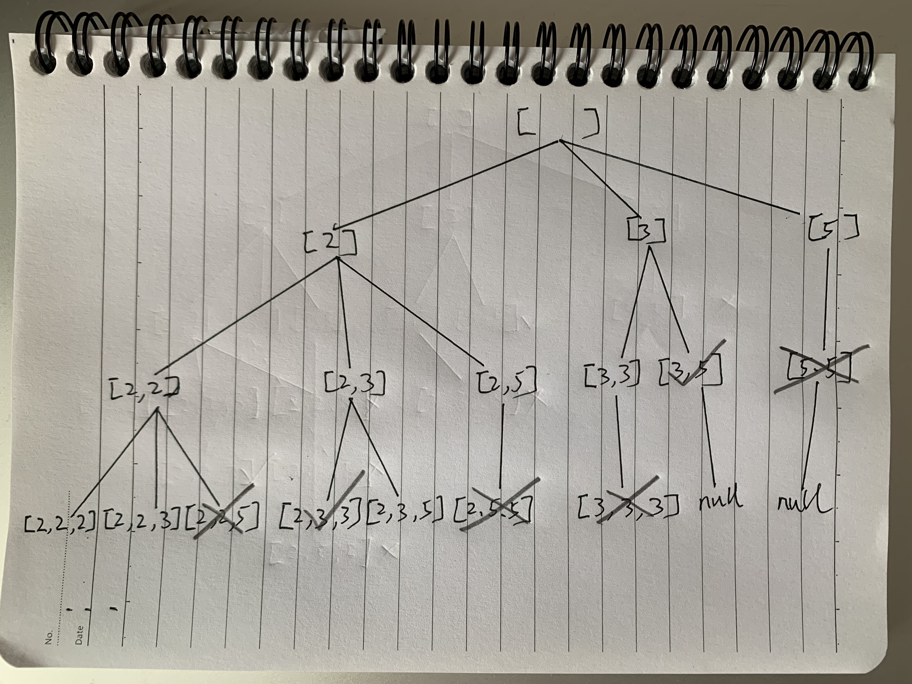

* content
{:toc}

## 39. 组合总和

给定一个无重复元素的数组 candidates 和一个目标数 target ，找出 candidates 中所有可以使数字和等于 target 的组合。

candidates 中的数字可以无限制重复被选取。

说明：

所有数字（包括 target）都是正整数。
解集不能包含重复的组合。

示例 1：

```
输入：candidates = [2,3,6,7], target = 7,
所求答案是：
[
  [7],
  [2,2,3]
]
```

示例 2：

```
输入：candidates = [2,3,5], target = 8,
所求答案是：
[
  [2,2,2,2],
  [2,3,3],
  [3,5]
]
```

提示：

```
1 <= candidates.length <= 30
1 <= candidates[i] <= 200
candidate 中的每个元素都是独一无二的。
1 <= target <= 500
```

来源：力扣（LeetCode）

链接：[https://leetcode-cn.com/problems/combination-sum/](https://leetcode-cn.com/problems/combination-sum/)

Link：[https://leetcode.com/problems/combination-sum/](https://leetcode.com/problems/combination-sum/)

## DFS

找到所有的答案，标准的DFS, 时间复杂度 = 答案个数 * 每个答案构建时间

以[2, 3, 5]为例：



用数组ans记录临时答案:

ans的和如果大于target, 就没有必要继续了

ans的和如果等于target, 找到答案，**拷贝**到结果中。

```
ans = [], [2], [2,2], [2,2,2], [2,2,2,2] # 找到答案，回溯
ans = [2, 2, 2] # 继续搜索
ans = [2, 2, 2, 3], [2, 2, 2, 5] # 都太大了, 回溯
ans = [2, 2], 继续搜索
ans = [2, 2, 3]
...
```


```python
class Solution:
    def combinationSum(self, candidates: List[int], target: int) -> List[List[int]]:
        
        res = []
        candidates.sort()
        self.helper(candidates, target, 0, [], res)
        return res
        
    def helper(self, candidates: List[int], target: int, start: int , ans: List[int] , res : List[List[int]]) -> None:
        
        total = sum(ans)
        if total > target:
            return 
        
        if total == target:
            res.append(ans.copy())
            return
        
        for i in range(start, len(candidates)):
            
            ans.append(candidates[i])
            self.helper(candidates, target, i, ans, res)
            ans.pop()
```

--End--


