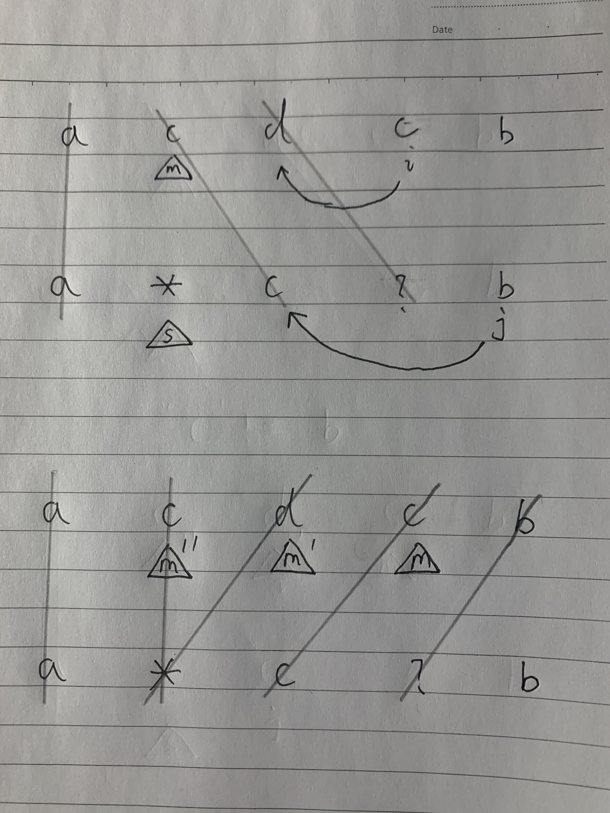

* content
{:toc}

## 44. 通配符匹配

给定一个字符串 (s) 和一个字符模式 (p) ，实现一个支持 '?' 和 '*' 的通配符匹配。

'?' 可以匹配任何单个字符。

'*' 可以匹配任意字符串（包括空字符串）。

两个字符串完全匹配才算匹配成功。

说明:

s 可能为空，且只包含从 a-z 的小写字母。

p 可能为空，且只包含从 a-z 的小写字母，以及字符 ? 和 *。

示例 1:

```
输入:
s = "aa"
p = "a"
输出: false
解释: "a" 无法匹配 "aa" 整个字符串。
```

示例 2:

```
输入:
s = "aa"
p = "*"
输出: true
解释: '*' 可以匹配任意字符串。
```

示例 3:

```
输入:
s = "cb"
p = "?a"
输出: false
解释: '?' 可以匹配 'c', 但第二个 'a' 无法匹配 'b'。
```

示例 4:

```
输入:
s = "adceb"
p = "*a*b"
输出: true
解释: 第一个 '*' 可以匹配空字符串, 第二个 '*' 可以匹配字符串 "dce".
```

示例 5:

```
输入:
s = "acdcb"
p = "a*c?b"
输出: false
```

来源：力扣（LeetCode）

链接：[https://leetcode-cn.com/problems/wildcard-matching/](https://leetcode-cn.com/problems/wildcard-matching/)

Link：[https://leetcode.com/problems/wildcard-matching/](https://leetcode.com/problems/wildcard-matching/)

## 动态规划

O(M*N)

### 递推公式

```
# 定义dp[i][j]代表s中前i个字符和p中前j个字符能否匹配, 所要计算的答案就在dp[len(s)][len(p)]中

情况一: 如果最后两个字母相等, 只要比较'xxxx'部分即可

xxxxxxxxx c
xxxxxx c

dp[i][j] = dp[i - 1][j - 1]

情况二: 如果最后两个字母p中包含'?', 同上

xxxxxxxxx c
xxxxxx ?

dp[i][j] = dp[i - 1][j - 1]

情况三: 如果最后两个字母p中包含'*'

xxxxxxxxx c
xxxxxx *

dp[i][j] = dp[i][j - 1] or dp[i - 1][j]
               ^                ^
          '*'匹配空字符     '*'先匹配一个字符
```

### 计算方向

以 s = "acdcb", p = "**c?b" 为例

```
\    0    *    *    c    ?    b

0    T    T    T    F    F    F

a    F                        ｜

c    F                        ｜

d    F                        ｜

c    F                        ｜

b    F  -------------------  答案
```

dp是一个二维矩阵，需要从左上角->右下角，**第一行 + 第一列**的初始值非常重要

###  初始条件

显然，空字符可以匹配, **dp[0][0] = True**

第一行, 代表**s中的''**, 能否和**p[:j]匹配，其中j = range(0, len(p) + 1)**, 只有*能匹配.

第一列，代表**p中的''**, 能否和**s[:i]匹配, 其中i = range(0, len(s) + 1)**, 显然都不能。

代码如下:

```python
class Solution:
    def isMatch(self, s: str, p: str) -> bool:
        
        m = len(s)
        n = len(p)
        
        dp = [[False for i in range(n + 1)] for j in range(m + 1)]
        dp[0][0] = True # 初始化
        
        for i in range(1, n + 1):
            if p[i - 1] == '*': 
                dp[0][i] = dp[0][i - 1] # 第一行初始化
        
        for i in range(1, m + 1):
            for j in range(1, n + 1):            
                if (p[j - 1] == '?' or s[i - 1] == p[j - 1]): #条件2 + 1
                    dp[i][j] = dp[i - 1][j - 1]
                elif p[j - 1] == '*': # 条件3
                    dp[i][j] = dp[i][j - 1] or dp[i - 1][j]
                
        return dp[m][n]
```

## 贪心 + DFS

O(M * N)

start记录上一个'*'的位置

match记录下一个该匹配字符的起始位置

1. 该算法还是挺快的，若不是遇到相等或者'?'的情况，'*'会尽可能匹配更多的字符
2. 一旦发现后面不能匹配, 回到记录点, 重复上述步骤



如上图第一排，相匹配的用线划掉, 直到i和j无法匹配, i和j回到上次*匹配点, 尝试匹配更多字符

图中第二排, *尝试匹配了两个字符之后，才继续后续判断

## 最坏情况如下:

```
s ="aaaaaaaaaaaaaaaaaaaaaa" to match p ="*aaaaaab"
                                         ^
                           尝试匹配0, 1, 2, 3 ...个a
```

代码如下:

```python
class Solution:
    def isMatch(self, s: str, p: str) -> bool:
    
        i = j = 0
        match = start = -1
        
        while i < len(s):
            if j < len(p) and (s[i] == p[j] or p[j] == '?'):
                i += 1
                j += 1
                
            elif j < len(p) and p[j] == '*':
                start = j
                match = i

                j += 1
            elif start != -1:
                j = start + 1
                match += 1
                i = match
            else:
                return False
                
        while (j < len(p) and p[j] == '*'):
            j += 1
            
        return j == len(p)
```

--End--