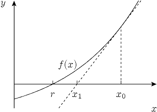

* content
{:toc}

## 69. x 的平方根

实现 int sqrt(int x) 函数。

计算并返回 x 的平方根，其中 x 是非负整数。

由于返回类型是整数，结果只保留整数的部分，小数部分将被舍去。

示例 1:

```
输入: 4
输出: 2
```

示例 2:

```
输入: 8
输出: 2
说明: 8 的平方根是 2.82842..., 
     由于返回类型是整数，小数部分将被舍去。
```

来源：力扣（LeetCode）

链接：[https://leetcode-cn.com/problems/sqrtx](https://leetcode-cn.com/problems/sqrtx)

Link：[https://leetcode.com/problems/sqrtx](https://leetcode.com/problems/sqrtx)

## 暴力破解

O(N)

```python
class Solution:
    def mySqrt(self, x: int) -> int:
        
        res = 0
        while (res + 1) ** 2 <= x:
            res += 1
            
        return res
```

## 二分法

O(logN)

### 模版一

```python
class Solution:
    def mySqrt(self, x: int) -> int:
        start = 0
        end = x

        while (start + 1 < end):
            mid = start + (end - start) // 2

            if (mid * mid > x):
                end = mid
            elif (mid * mid < x):
                start = mid
            else:
                return mid

        return end if (end * end <= x) else start
```

### 模版二

```python
class Solution:
    def mySqrt(self, x: int) -> int:
    
        start = 0
        end = x
        
        while start < end:
            mid = start + (end - start) // 2
            
            if (mid * mid > x):
                end = mid
            elif (mid * mid < x):
                start = mid + 1
            else:
                return mid
            
        return start if start * start <= x else start - 1
```

### 模版三

```python
class Solution:
    def mySqrt(self, x: int) -> int:

        start = 0
        end = x
        
        while start <= end:
            mid = start + (end - start) // 2
            
            if (mid * mid > x):
                end = mid - 1
            elif (mid * mid < x):
                start = mid + 1
            else:
                return mid
            
        return start if start * start <= x else start - 1
```

## 比特位

O(1)

一个32位数字2^16 * 2 ^16 = 2^32

所以一个数的平方根，最多只有16位比特

```
先尝试第16th位，设置位1，计算平方，如果大于x, 取值为零
 1      0       0       0       0       ...
16位   15位     14位    13位    12位

先尝试第15th位，设置位1，计算平方，如果大于x, 取值为零
 0      1       0       0       0       ...
16位   15位     14位    13位    12位

一次类推，一共16次计算
```

代码如下:

```python
class Solution:
    def mySqrt(self, x: int) -> int:
        bit = 1 << 16
        res = 0
        
        while bit > 0:
            res |= bit
            
            if res * res > x:
                res ^= bit
                
            bit >>= 1
                
        return res
```

## 牛顿迭代

O(未知​), 总之迭代次数很少

令f(x) = x^2 - target, 当f(x)无限接近0时，x就是target的平方根



从一个尝试值X0出发，然后以这个做方程的切线，与X轴交叉，得到新的值X1，以此类推

### 递推计算

f(x0)点, 斜率k, 令切线函数t(x) = kx + b

k = 二次曲线f(x0)处的导数 = 2x0

```
k = (t(x0) - t(x1)) / (x0 - x1) = 2x0

x1 = x0 - (x0 - x1)  # 右侧三角形的底边

   = x0 - (t(x0) - t(x1)) / 2x0 # 将底边用侧边与斜率k替换

   = x0 - t(x0) / 2x0 # 切线上t(x1) = 0
   
   = x0 - (x0^2 - target) / 2x0 # 将函数t(x0)用二次方程替换f(x0)

   = (x0^2 + target) / 2x0 # 为了兼容python3, 不再往下推导
```

代码如下:

```python
class Solution:
    def mySqrt(self, x: int) -> int:
        
        res = x
        while res * res > x:
            res = (res * res + x) // (2 * res)
                
        return res
```

当然还有Quake III Arena神来之笔[https://en.wikipedia.org/wiki/Fast_inverse_square_root](https://en.wikipedia.org/wiki/Fast_inverse_square_root)

--End--