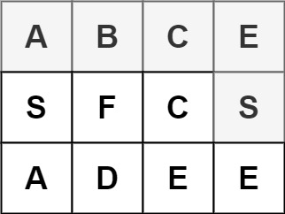

* content
{:toc}

## 79. 单词搜索

给定一个二维网格和一个单词，找出该单词是否存在于网格中。

单词必须按照字母顺序，通过相邻的单元格内的字母构成，其中“相邻”单元格是那些水平相邻或垂直相邻的单元格。同一个单元格内的字母不允许被重复使用。


示例:



```
board =
[
  ['A','B','C','E'],
  ['S','F','C','S'],
  ['A','D','E','E']
]

给定 word = "ABCCED", 返回 true
给定 word = "SEE", 返回 true
给定 word = "ABCB", 返回 false
```

来源：力扣（LeetCode）

链接：[https://leetcode-cn.com/problems/word-search](https://leetcode-cn.com/problems/word-search)

Link：[https://leetcode.com/problems/word-search/](https://leetcode.com/problems/word-search/)

## 回溯

O(N * 3^L), 除了第一个位置4个方向，接下来只有3个方向，L代表word长度

从起点字符开始，观察四个方向, 如果满足就分别去尝试。

```python
class Solution:
    def exist(self, board: List[List[str]], word: str) -> bool:
        
        self.directions = [(0, 1), (1, 0), (0, -1), (-1, 0)]
        
        for i in range(len(board)):
            for j in range(len(board[0])):
                if board[i][j] == word[0] and self.helper(board, word, i, j, 1, set([(i, j)])):
                    return True
                
        return False
        
        
    def helper(self, board: List[List[str]], word: str, x: int, y:int, index: int, visited: set) -> None:     
        
        if index == len(word):
            return True
        
        for k in range(len(self.directions)):
            
            new_x = x + self.directions[k][0]
            new_y = y + self.directions[k][1]
            
            if (new_x, new_y) in visited:
                continue

            if 0 <= new_x < len(board) and 0 <= new_y < len(board[0]) and board[new_x][new_y] == word[index]:             
                visited.add((new_x, new_y))
                if self.helper(board, word, new_x, new_y, index + 1, visited):
                    return True  
                visited.remove((new_x, new_y))
            
        return False
```

先看当前是否满足，如果满足，再递归去看四个方向

```python
class Solution:
    def exist(self, board: List[List[str]], word: str) -> bool:
        
        self.directions = [(0, 1), (1, 0), (0, -1), (-1, 0)]
        
        for i in range(len(board)):
            for j in range(len(board[0])):
                if self.helper(board, word, i, j, 0, set()):
                    return True
                
        return False
        
        
    def helper(self, board: List[List[str]], word: str, x: int, y:int, index: int, visited: set) -> None:     
        
        if index == len(word):
            return True
        
        if (x, y) not in visited and 0 <= x < len(board) and 0 <= y < len(board[0]) and board[x][y] == word[index]:

            visited.add((x, y))
            for k in range(len(self.directions)):
                
                new_x = x + self.directions[k][0]
                new_y = y + self.directions[k][1]

                if self.helper(board, word, new_x, new_y, index + 1, visited):
                    return True  
            visited.remove((x, y)) 
            
        return False
```


--End--
