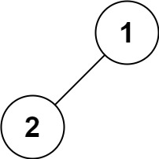

* content
{:toc}

## 94. 二叉树的中序遍历

给定一个二叉树的根节点 root ，返回它的 中序 遍历。

示例 1：

 

```
输入：root = [1,null,2,3]
输出：[1,3,2]
```

示例 2：

```
输入：root = []
输出：[]
```

示例 3：

```
输入：root = [1]
输出：[1]
```

示例 4：

 

```
输入：root = [1,2]
输出：[2,1]
```

示例 5：


```
输入：root = [1,null,2]
输出：[1,2]
```

提示：

```
树中节点数目在范围 [0, 100] 内
-100 <= Node.val <= 100
```

> 进阶: 递归算法很简单，你可以通过迭代算法完成吗？


来源：力扣（LeetCode）

链接：[https://leetcode-cn.com/problems/binary-tree-inorder-traversal](https://leetcode-cn.com/problems/binary-tree-inorder-traversal)

Link：[https://leetcode.com/problems/binary-tree-inorder-traversal/](https://leetcode.com/problems/binary-tree-inorder-traversal/)

## 递归

O(N)

中序遍历，就是左->中->右

```python
class Solution:
    def inorderTraversal(self, root: TreeNode) -> List[int]:
        res = []
        self.traverse(root, res)
        return res
        
        
    def traverse(self, node: TreeNode, res: List[int]):
        if node is None:
            return
        
        self.traverse(node.left, res)
        res.append(node.val)
        self.traverse(node.right, res)
```

## 非递归

O(N)

这个没法解释，只能自己尝试着推导一下

首先，要输出最左边的**左节点**, 那之前的路径用stack保存下来, 用来回退到**中节点**

结尾的时候，当前值cur要变化，那把它置为**右节点**

```python
class Solution:
    def inorderTraversal(self, root: TreeNode) -> List[int]:

        res = []
        stack = []
        cur = root
        
        while cur is not None or len(stack) > 0:
            while cur is not None and cur.left is not None:
                stack.append(cur)
                cur = cur.left
                
            if cur is None:
                cur = stack.pop()
                
            res.append(cur.val)
            cur = cur.right
                        
        return res
```

多入栈一次，少了一些判断

```python
class Solution:
    def inorderTraversal(self, root: TreeNode) -> List[int]:
                
        res = []
        stack = []
        cur = root
        
        while cur is not None or len(stack) > 0:
            while cur is not None:
                stack.append(cur)
                cur = cur.left
                
            cur = stack.pop()   
            res.append(cur.val)
            cur = cur.right
                        
        return res
```

--End--
